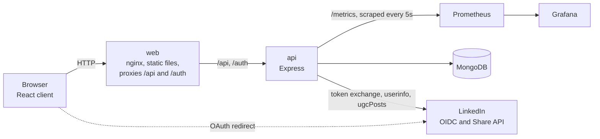
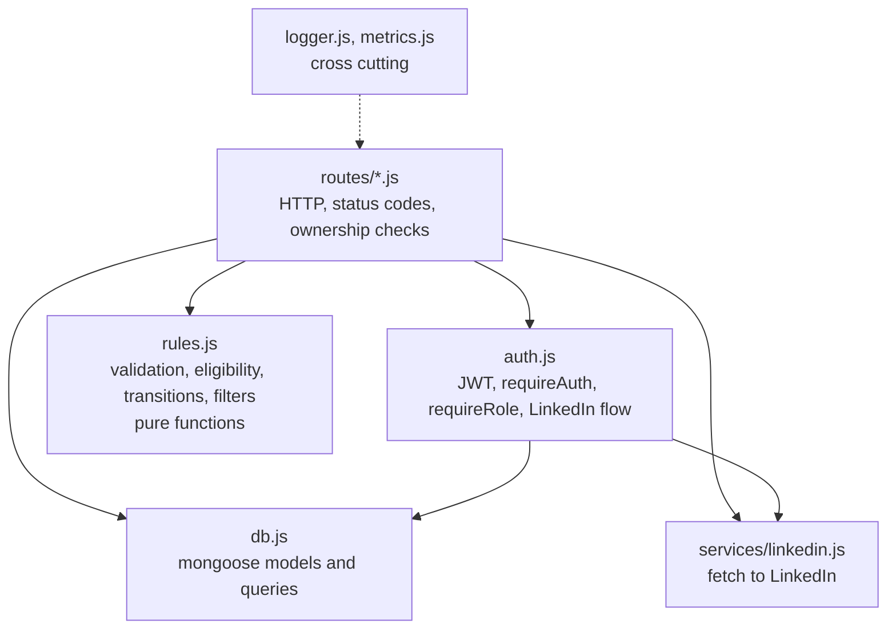
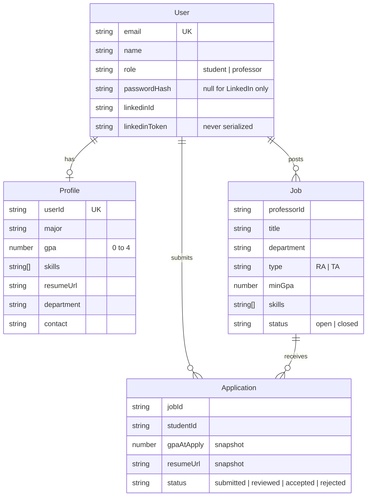

# Architecture

## Components

Five containers. The browser only ever talks to nginx. nginx serves the built React app and forwards `/api` and `/auth` to the API. The API is the only component that talks to MongoDB and LinkedIn. Prometheus scrapes the API, Grafana reads Prometheus.

## Layers inside the API

Routes are thin. They parse the request, call a rule, call the database, and pick a status code. Rules have no I/O, so they are unit tested without a database. The database module is the only file that imports mongoose. The LinkedIn service is the only file that calls the network, so tests mock one module.

## Data model

One profile document serves both roles with optional fields. An application stores the GPA and resume link at the time of applying, so a later profile edit does not change what the professor reviewed. The pair jobId and studentId is a unique index, which is what enforces one application per opening.

## Request flow: a student applies

1. Browser sends `POST /api/applications` with the bearer token.
2. `requireAuth` decodes the JWT. `requireRole('student')` checks the role.
3. The route loads the job and checks for an existing application.
4. `rules.checkEligibility(profile, job)` returns ok or a reason.
5. On a reason, the route answers 422 with that text and counts an ineligible attempt in `applications_total`.
6. On ok, the route creates the application, counts a submitted attempt, and logs `application.submitted` with the request id.

## Request flow: LinkedIn sign in

1. Browser follows `/auth/linkedin?role=professor`. The API stores a random state and the role in a short lived cookie and redirects to LinkedIn with scopes `openid profile email`, plus `w_member_social` for professors.
2. LinkedIn redirects to `/auth/linkedin/callback?code&state`. The API checks the state against the cookie.
3. The API exchanges the code for an access token, calls userinfo, and finds or creates the user. The access token is saved on the user for sharing and is never returned by the API.
4. The API redirects to the web app with the JWT in the URL fragment. The client stores it and clears the fragment.

## Observability

Every request gets an id from `x-request-id` or a new UUID, returned in the response header. Logs are JSON lines with time, level, request id, method, url, status, and response time. Domain events add an `event` field. Metrics: `http_requests_total` and `http_request_duration_seconds` by route and status, `jobs_created_total`, `applications_total` by outcome, `login_attempts_total` by provider and result, `linkedin_shares_total` by result. The Grafana dashboard in `docker/grafana/dashboards/campus-works.json` has seven panels built on these.
